```{r setup, include=FALSE}
knitr::opts_chunk$set(echo = TRUE)
```

# Pod/Node Configuration

## Config Maps

Creating a config map to inject into a deployment:

```kubectl create configmap webapp-config-map --from-literal=APP_COLOR=darkblue —from-literal=APP_SIZE=12 …```

OR

```Kubectl create configmap app-config --from-file=app_config.properties```

OR

```Kubectl create -f <below_yaml>```

Creating configmap via yaml:

```
apiVersion: v1
kind: ConfigMap
metadata:
	name: app-config
data:
	APP_COLOR: blue
	APP_MODE: prod
```

THEN replace the -env field with:

```
envFrom:
	- configMapRef:
		name: app-config
```

* REPLACING PODS THAT CAN’T BE EDITED (usually due to env variables):
	1) Try to edit, get error, quit
	2) Input following command with the temp yaml: 
		kubectl replace --force -f /tmp/kubectl-edit-2711348812.yaml

\

## Secrets

```
apiVersion: v1
kind: Secret
metadata:
	name: app-secret
data:
	DB_Host: awekm+12
	DB_User: cdksfd==
	DB_Password: cDGfSAa
```

* IF GOING YAML: you need to encode via <echo -n “name” | base64> to convert into base 64 or else k8 won’t allow you to create the secret

- Injecting env variables into pods

1) environment
```
envFrom:
	- secretRef:
		name: app-secret
```

2) a single variable
```
env:
	- name: DB_Password
	  valueFrom:
		secretKeyRef:
			name: app-secret
			key: DB_Password
```

3) Volumes
```
volumes:
- name: app-secret-volume
  secret:
	secretName: app-secret
```

\

Can also define a secret via certificates with the implicit command:

```
kubectl create secret <secret_type> <secret_name> \
  --cert "<cert_path>" \
  --key  "<key_path>"
```

\

## Security Contexts
Under spec in pod yaml, can set the security for a user on the docker image for the pod:

```
spec:
	securityContext:
		runAsUser: 1000.  #User id
```

OR for the container level:

```
spec:
	containers:
		securityContext:
			runAsUser: 1000
			capabilities:
				add: [“MAC ADMIN”]
```

* To identify the user privileges in a pod: 

```kubectl exec <podname> -- whoami```

\

## Service Accounts

Provides an identity for processes that run in a pod

Create a service account:

```Kubectl create serviceaccount <sa_name>```

* Each time service account object is created, a token is assigned to a created secret object which links BACK to the sa. (Ex: can be used to authenticate connection via apps to k8 API)
	- Can also mount this secret token into a persistent volume if app using it is within the cluster

Request service account token:

```kubectl create token <sa_name>```

Viewing secret token:

```kubectl describe secret <sa_tokens_found_in_describe_serviceaccount>```


Attaching a custom serviceaccount on pod creation:

```
spec:
	containers:
		…
	serviceAccountName: <sa_name>
```

\

## Resource Requests/Limits

Including specific requests/limits for container in a pod yaml:
```
spec:
	containers:
		-name:
		 image
		 …
		 resources:
			requests:
				memory: “1Gi”
				cpu: 1
			limits:
				memory: “2Gi”
				cpu: 2
```

* cpu: 0.1 cpu is min, throttled when exceeding limit
* memory: Gi = “gibibyte”, possible to exceed limit temporarily but will be shut down if constantly exceeding

\

## Taints/Tolerances

Taint - a way in which we can label nodes for certain types of pods
Toleration - a permission applied which pairs a pod with a node labeled with a taint

* Taints/tolerations DO NOT tell a pod to go to a specific node; they just give elevated permissions
	- i.e. a pod with a toleration is still allowed to be allocated to a node without a taint

Creating a taint:

```kubectl taint nodes <node_name> <key>=<value>:<taint-effect>```

Identify a taint:

```kubectl describe node <node_name> | grep Taint```

Taint effect - what happens to pods that do not tolerate this taint?
	- NoSchedule: pod not scheduled on node
	- PreferNoSchedule: node prioritized last
	- NoExecute: new pods won’t be scheduled AND old pods without toleration will be booted


Giving a pod a toleration:
```
spec:
	containers:
		…
	tolerations:
	- key: “app”
	  operator: “Equal”
	  value: “blue”
	  effect: “NoSchedule”
```

* Interesting application: master nodes are given a taint which is not given to any pod. This allows the master node to remain as the “scheduler”, assigning tasks to the worker nodes. 

\

## Node Selector/Affinity

Node selector- limiting a pod to a specific node

```
spec:
	containers:
		…
	nodeSelector:
		size: Large
```

*size=Large is a key/value label assigned to the node

	kubectl label nodes <label_name> <label_key>=<label_value>


Node Affinity - ensure that pods are assigned to particular nodes by providing advanced boolean expressions

```
spec:
	containers:
		…
	affinity:
		nodeAffinity:
			requiredDuringSchedulingIgnoredDuringExecution:
				nodeSelectorTerms:
				- matchExpressions:
					- key: size
				  	  operator: NotIn
				  	  values:
				  	  - Small
```

* can also just target by the existence of a label

```
affinity:
	nodeAffinity:
		requiredDuringSchedulingIgnoredDuringExecution:
			nodeSelectorTerms:
			- matchExpressions:
				- key: size
			  	  operator: Exists
```

\

<b>NOTE:</b> Combinations of taints/tolerations AND node affinity sometimes need to be used to ensure that all pods are assigned to all anticipated nodes

\
\

# Multi-Container Pods

## Overview

It's possible to place multiple containers into the same pods so that they can have access to the same network and storage.

Don't have to establish volume sharing or services between pods to enable communication between.

yaml example:

```
apiVersion: v1
kind: Pod
metadata:
  name: simple-webapp
  labels:
    name: simple-webapp
spec:
  containers:
  - name: simple-webapp
    image: simple-webapp
    ports:
      - containerPort: 8080
  - name: log-agent
    image: log-agent
```

\

Three design patterns:

<div class = "row">
<div class = "col-md-4">
1) <b>Sidecar</b> - Basic "add-on" container to a pod <br>
  ex: deploying logging agent along a web server to collect logs and forwarding them to a central log server.
</div>
<div class = "col-md-4">
2) <b>Adapter</b> - standardize/normalize application output <br>
  ex: Converting various formats of logs into one single standardized format via an adapter container before sending to web server
</div>
<div class = "col-md-4">
3) <b>Ambassador</b> - connecting containers to outside world based on varying need <br>
  ex: Application communicating to different databases at different stages of development
</div>
</div>


\

## Init Containers

Init containers are special types of containers which:
a. will only run once when the pod is first created
b. a process that waits for an external service/database to be up before the actual application starts

Init containers must first run to completion before the real container hosting the application starts (pod will restart repeatedly if any fail occurs)

Multiple initContainers can be configured in one pod (will be run sequentially)


Example yaml:

```
apiVersion: v1
kind: Pod
metadata:
  name: myapp-pod
  labels:
    name: myapp-pod
spec:
  containers:
  - name: myapp-container
    image: busybox:1.28
    commands: ['sh', '-c', 'echo The app is running! && sleep 3600']
  initContainers:
  - name: init-myservice
    image: busybox
    command: ['sh', '-c', 'git clone <target-repo> ;']
```

\
\

# Probing/Logging Pods (Observability)

## Readiness and Liveness Probes

<b>Pre-Reqs:</b>

Pod Statuses:
<ul>
<li>Pending (scheduler is trying to figure out where to put the pod)
<li>ContainerCreating (images required for app and pulled and container starts)
<li>Running (continues until program completes/is terminated)
</ul>

Pod Conditions (True/False): PodScheduled, Initialized, ContainersReady, Ready


Ready - pod is running and ready to accept user traffic, but this has different meanings in different contexts...

*** This can be problematic!! Especially if a service directs to a container that is "Ready" but not really ready. 

<b>Readiness probes:</b> ways in which one can actually identify if a container is truly ready

Pod yaml examples:

<ul>
<li> web app: http test to see if the server responds (/api/ready)
```
containers:
  - name:
    ...
    readinessProbe:
      httpGet:
        path: /api/ready
        port: 8080
```
</li>
<li> database: TCP Test to see if a socket is listening (3306)
```
containers:
  - name:
    ...
    readinessProbe:
      tcpSocket:
        port: 3306
```
</li>
<li> exec: create a command that will succesfully complete if the container is ready (cat /app/is_ready)
```
containers:
  - name:
    ...
    readinessProbe:
      exec:
        command:
          - cat
          - /app/is_ready
```
</li>
</ul>

\

*** Back to the service example, an httpGet test can be used on each container to verify with the service that the pod is ready to accept traffic.

\

<b>Liveness Probes:</b> useful for when an application is "broken" but the container continues to run (ex: bug in code keeps app stuck in infinite loop)

Periodically checks the health of an application (this is what we get to define!)


<b>JUST LIKE READINESS, but replace "readinessProbe" with "livenessProbe"</b>


There does exist extra options!

```
livenessProbe:
  httpGet:
    path: /api/healthy
    port: 8080
  initialDelaySeconds: 10
  periodSeconds: 5
  failureThreshold: 8
```


\

## Container Logging

Aside: You can run images on Docker and identify the logs via the following commands

```
docker run -d <image-name>
docker logs -f ecf
```
Note: -d=daemon, -f=live log trail


In the same way, we can pull the logs of a pod via a live stream with the following command:

`kubectl logs -f <pod-name> <container-name-if-multiple>`

\

## Monitoring and Debugging Applications

Common open source monitoring software: Metrics Server, Prometheus, Elastic Stack, Datadog, dynatrace

Metrics Server:
* Can have one metric server per k8 cluster
* Only an in-memory monitoring solution (can't see historical performance!)

kubelet - agent run on each node which is responsible for receiving instructions from master node and running pods in nodes <br>
        - also contains sub-component cAdvisor which is responsible for receiving pod metrics and passing along to monitoring software via API
        

To enable the metrics server, run the following:

```
minikube: minikube addons enable metrics-server
other: git clone https://github.com/kubernetes-incubator/metrics-serve

kubectl create -f deploy/1.8+/
```

can then see monitoring vals via:

```
kubectl top node

kubectl top pod
```

\
\

# Pod Design

## Labels, Selectors, and Annotations

<b>labels:</b> standard method to group and filter objects together based on criteria

<b>selectors:</b> aid in filtering labels


under "metadata" as many labels can be used as desired!

```
apiVersion: v1
kind: Pod
metadata:
  name: simple-webapp
  labels:
    app: App1
    function: Front-end
...
```

can then select specific labels via the --selector flag:

`kubectl get pods --selector app=App1`


getting all objects with a certain label:

`kubectl get all --selector app=App1`

getting objects with multiple label criteria:

`kubectl get pods --selector env=prod,bu=finance,tier=frontend`

<b>Note:</b> In deployments/replicasets, labels are introduced in two places
<ul>
<li> top - labels configured for deployments/replicasets themselves (used if we needed to configure some other object to discover replicaset)
<li> template - labels configured for pods in deployments/replicasets (used for the replicaset to identify the pods)
</ul> matchLabels - ties the replicaset to the pods (can use multiple if you think there will be other pods with the same label but different functionality)

example:

```
apiVersion: apps/v1
kind: ReplicaSet
metadata:
  name: simple-webapp
  labels:
    app: App1
    function: Front-end
spec:
  replicas: 3
  selector:
    matchLabels:
      app: App1
  template:
    metadata:
      labels:
        app: App1
        function: Front-end
    spec:
      containers:
      - name: simple-webapp
        image: simple-webapp
```

\

<b>Annotations:</b> used to record other details for information purposes

\

## Rolling Updates & Rollbacks in Deployments

When a deployment is created, a new rollout is first created. A new rollout creates a new deployment revision.

Helps us keep track of changes from deployment to deployment

Tracking status of deployment:

`kubectl rollout status deployment/myapp-deployment`

History/revisions of a deployment:

`kubectl rollout history deployment/myapp-deployment --revision=<optional-desired-revision-info>`


Can either destroy instances, followed by recreating with newer... BAD!!! inaccessible to users for a time. INSTEAD destroy and upgrade a few at a time.

Update a deployment: while there is an imperative command, best to go the declarative `apply` route so that the deployment is in agreement with the yaml file.

Imperative: `kubectl scale deployment --replicas=<num-replicas> <deployment-name>`

In an update, under the hood, a new replicaset is created with desired number of pods and the old pods are slowly terminated

Undoing a rollout:

`kubectl rollout undo deployment/myapp-deployment`

\

## Deployment Strategies:

<b>Recreate</b>: Destroy all the pods and then recreate them

<b>Rolling</b>: Take down older version and bring up newer version one-by-one (default!)

<b>Blue/Green:</b>

1) New version (Green) is deployed alongside the old version (Blue)

2) While Blue continues to retain the traffic, Green undergoes a series of tests to ensure stability

3) Once all the tests are passed, all the traffic is then diverted to Green at once

* This strategy relies on labels and updating them. By deploying green to a different label, we just need to switch the service's label reference to that of the green deployment

* In practice, this involves declaring a `version:` argument within the `selector:` in both the service and deployment objects

<b>Canary:</b>

1) Deploy the new version and route only small percentage of traffic to it

2) Run tests to ensure stability

3) Once all tests are passed, use the rolling updates strategy to switch to the new deployment

* To have traffic moving to a small percentage, create a common label for both applications and reduce the number of replicas deployed in the new version

* Traffic split will always be governed by the number of pods, though there are ways to do this with external applications!


\

## Jobs

The default setting for kubernetes is for a pod to be continually redeployed upon full execution of a job. Explicitly:

```
apiVersion: v1
kind: Pod
metadata:
  name: math-pod
spec:
  containers:
  - name: math-add
    image: ubuntu
    command: ['expr', '3', '+', '2']
  restartPolicy: Always
```


This is a little different for deployments. While a <b>replicaset</b> is used to make sure a specified number of pods are running at all times, a <b>job</b> is used to run a set of pods to perform a given task to completion.


Creating a job:

```
apiVersion: batch/v1
kind: Job
metadata:
  name: math-add-job
spec:
  completions: 3
  template:
    spec:
    containers:
    - name: math-add
      image: ubuntu
      command: ['expr', '3', '+', '2']
    restartPolicy: Never
```

*** Notice how we used the pod's spec as a template for the job. In the above case, the job will be run three times.

If there's a situation where a job may fail one of the completions, it will continue to run until the desired completions have been attained.

Can also make these jobs parallel by including a `parallelism: <num_jobs>` line within `spec:`

\

## Cronjobs

A job that can be scheduled (note how the above job is placed within `jobTemplate:`)


<div class="row">
<div class="col-md-6">
```
apiVersion: batch/v1
kind: CronJob
metadata:
  name: reporting-cron-job
spec:
  schedule: "*/1 * * * *"
  jobTemplate:
    spec:
      completions: 3
      template:
        spec:
        containers:
        - name: math-add
          image: ubuntu
          command: ['expr', '3', '+', '2']
        restartPolicy: Never
```
</div>
<div class="col-md-6">
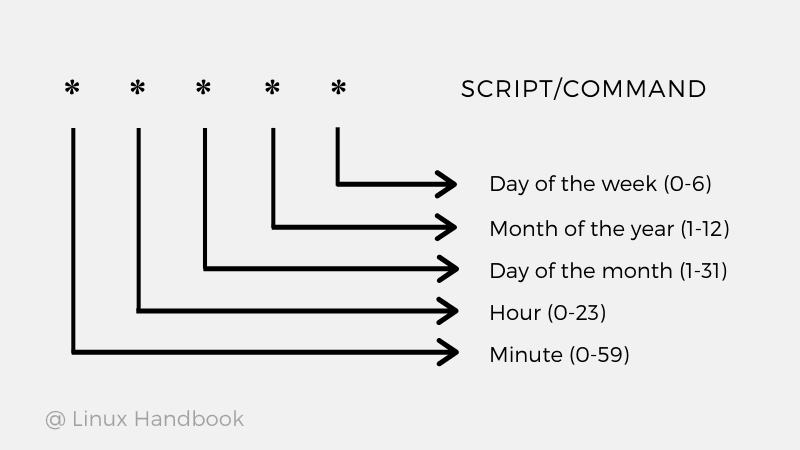
</div>
</div>

\
\

# Services & Networking

## Services

<div class = "row">
<div class="col-md-6">
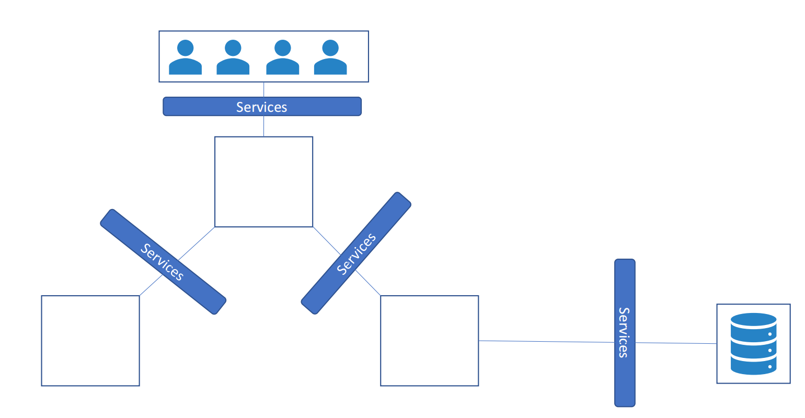
</div>
<div class="col-md-6">
<b>Service:</b> K8 object that enables communication between various components between applications via ports

Can connect between applications and users (ex: serving frontend loads to user, connecting to external data sources, etc...)

Frontend to users, frontend/backend pods, external data sources

Loose coupling between microservices between application
</div>
</div>

\

### Cluster IP

DEFAULT Kubernetes service

Gives service inside cluster that other apps inside cluster can access (no external access!)

Helps us group pods together and provide a single interface to access pods in a group

This then allows all pods to be able to scale/create/terminate without impacting communication between the various services

Each service gets an IP and a name (other pods should use this to access)

CAN access via kubernetes proxy by starting it and then navigating to endpoint

```
kubectl proxy --port=8080

http://localhost:8080/api/v1/proxy/namespaces/<NAMESPACE>/services/<SERVICE-NAME>:<PORT-NAME>/
```

Useful for debugging services, allowing internal traffic, displaying internal dashboards

Because method requires kubectl as authenticated user, DO NOT EXPOSE TO PUBLIC!

\

<div class = "row">
<div class="col-md-6">
```
apiVersion: v1
kind: Service
metadata:
  name: my-internal-service
spec:
  selector:
    app: my-app
  type: ClusterIP
  ports:
  - name: http
    port: 80
    targetPort: 80
    protocol: TCP
    
    
http://localhost:8080/api/v1/proxy/namespaces/default/services/my-internal-service:80/
```
</div>
<div class="col-md-6">
<br><br>
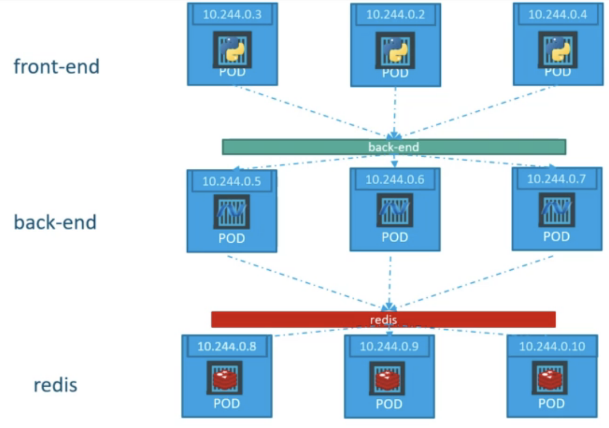
</div>
</div>


### NodePort
Opens a specific port on all the nodes, and any traffic that is sent to this port is forwarded to the service

Need to select a specific pod class to forward this port via `selector`; this links the service to the pod class and works as a built-in loadbalancer

`targetPort` refers to the port of the pod, whereas `port` refers to the port of the service (assumed to be the same if `targetPort` not included)

If `nodePort` is not selected, it will be assigned a value between 30000-32767

If Node/VM IP address changes, the NodePort must be manually altered

<b>Only useful for purposes of testing/demoing!</b>

\

<div class = "row">
<div class="col-md-6">
```
apiVersion: v1
kind: Service
metadata:
  name: my-nodeport-service
spec:
  selector:
    app: my-app
  type: NodePort
  ports:
  - name: http
    port: 80
    targetPort: 80
    nodePort: 30036
    protocol: TCP
```
</div>
<div class="col-md-6">
<br>
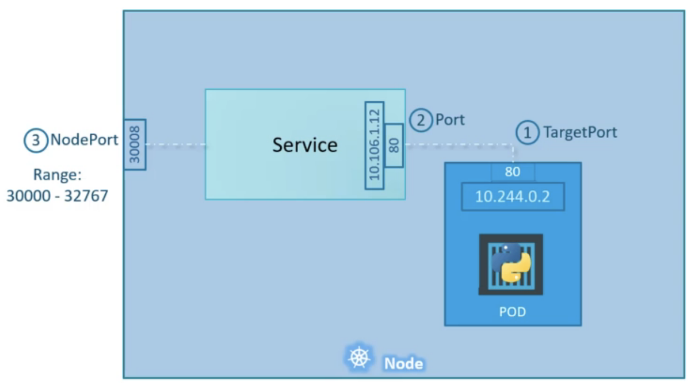
</div>
</div>

\

### Load Balancer

Standard way to expose a service to the internet

Usually implemented via a cloud provider, of which will give a single IP address that will forward all traffic to the service. Usually can't do this locally! Will need to provision the details there.

Useful for directly exposing a service, meaning you can send almost any kind of traffic to it (HTTP, TCP, UDP, Websockets, etc...)


<div class = "row">
<div class="col-md-6">
\
\

<b>CAUTION!</b> Each service you expose with a Load Balancer will get its own IP address. This can get expensive quick.

<br>
```
apiVersion: v1
kind: Service
metadata:
  name: my-lb-service
  labels:
    app: my-app
spec:
  type: LoadBalancer
  ports:
  - port: 8080
  selector:
    app: my-app
```
</div>
<div class="col-md-6">
<br>
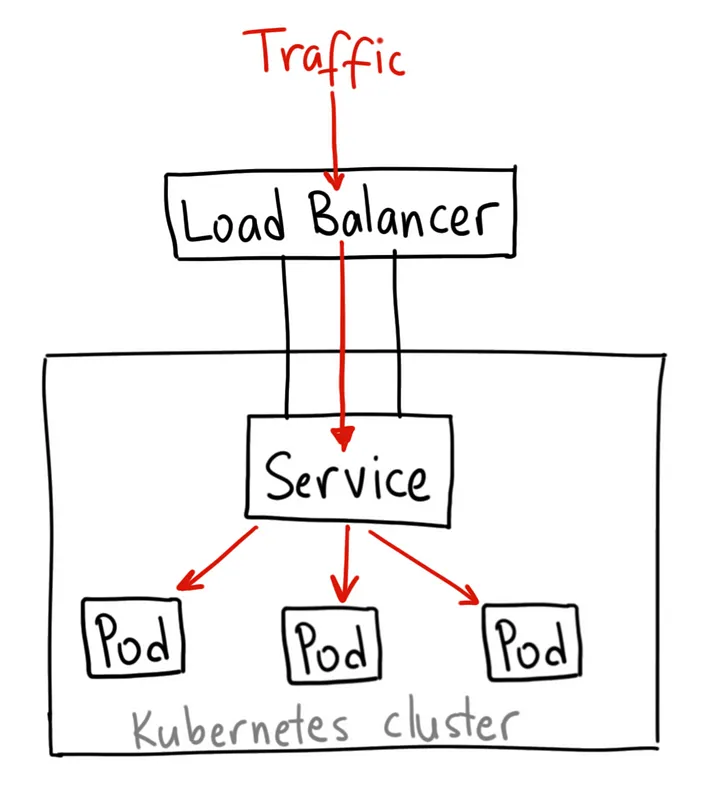
</div>
</div>

\

### Ingress

Why are the above not enough? While a NodePort / Loadbalancer can get the job done of accessing the specific node, 

<div class="row">
<div class="col-md-6">

* you will have to implement a proxy-server to redirect from a hard-to-remember nodePort service to the default port 80 (this is where a cloud load balancer would be helpful.. don't need a proxy!)

* Multiple pods providing multiple services will need their OWN load balancers (costly) and then a proxy load balancer to connect them all under the same DNS! 

* Not to mention enabling SSL so that users can access the website... a nightmare with individual loadbalancers / nodeports and proxy-servers...


<b>Ingress: </b> a way to store all of the above configuration shortfalls into a SINGLE yaml file

* Users can access application using a single externally accessible URL

* Can be configured to route traffic to different services within the cluster based on URL path

* Can easily implement SSL certification
</div>
<div class="col-md-6">
<br><br>
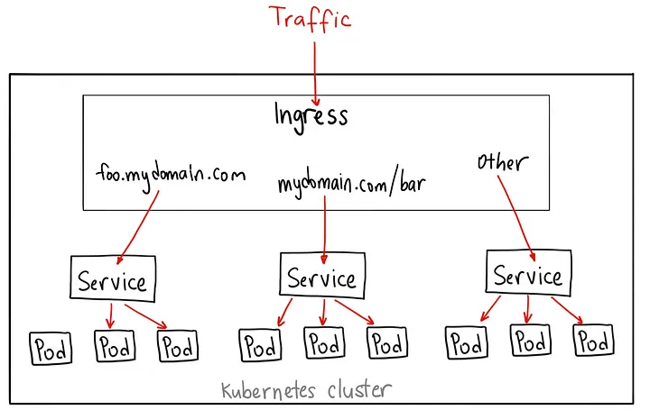
</div>
</div>

\

<div class="row">
<div class="col-md-6">

```
apiVersion: extensions/v1
kind: Deployment
metadata:
  name: nginx-ingress-controller
spec:
  replicas: 1
  selector:
    matchLabels:
      name: nginx-ingress
    template:
      metadata:
        labels:
          name: nginx-ingress
      spec:
        containers:
          - name: nginx-ingress-controller
            image: quay.io/kubernetes-ingress-controller/nginx-ingress-controller:0.21.0
        args:
          - /nginx-configuration-controller
          - --configmap=$(POD_NAMESPACE)/nginx-configuration
        env:
          - name: POD_NAME
            valueFrom:
              fieldRef:
                fieldPath: metadata.name
           - name: POD_NAMESPACE
             valueFrom:
              fieldRef:
                fieldPath:
                  metadata.namespace
        ports:
          - name: http
            containerPort: 80
          - name: https
            containerPort: 443
---

apiVersion: v1
kind: configMap
metadata:
  name: nginx-configuration
  
---

apiVersion: v1
kind: Service
metadata: 
  name: nginx-ingress
spec:
  type: NodePort
  ports:
  - port: 80
    targetPort: 80
    protocol: TCP
    name: http
  - port: 443
    targetPort: 443
    protocol: TCP
    name: https
  selector:
    name: nginx-ingress
    
---

apiVersion: v1
kind: ServiceAccount
metadata:
  name: nginx-ingress-serviceaccount
```
</div>
<div class="col-md-6">
<b>Ingress Controller:</b> A deployed reverse proxy/load balancer solution (nginx, HAProxy, Traefik); NOT deployed by default!

* nginx and GCP HTTP(S)/GCE are actively supported by K8 and should thus be preferred

\

Deployment configuration:

* within image, we must start the controller service `args: -/nginx-ingress-controller`

* configMap is useful for parameterizing options that may change within deployment (can begin as blank!)

* must pass in pod name and namespace to the environment so that the nginx-service can read the config info within the pod

* finally, specify the ports used by ingress controller

\
\
\
\
\
\
\
\
\
\
\
\
\
\
\
\
\
\
\
\
\
\
\
\

Service configuration: 

* Needed to link the ingress controller to the external world

* `nginx-ingress` links the service to the deployment

\
\
\
\

Service Account configuration:

* ingress controllers have additional intelligence to monitor K8 cluster and can modify nginx server when something has changed

* BUT requires a Service Account with the right set of permissions to interact with the pods

* Includes appropriate Roles, ClusterRoles, and RoleBindings

</div>
</div>

\

<b>Ingress Resources:</b> Set of rules to configure an ingress

* Can route traffic to different applications based on URL (example.com/watch, example.com/wear)

* Or even on the domain name itself! (watch.example.com, wear.example.com)

* Routed to application services and NOT the pods directly (makes sense)

* Create rules for each domain name

* Tip: Can route specific urls to their applications, and then create a final rule that routes all other urls to "404 Not Found"

\

<div class = "row">
<div class = "col-md-6">

Paths redirect to appropriate endpoint (ex: my-online-store.com/watch)

```
apiVersion: networking.k8s.io/v1
kind: Ingress
metadata:
  name: ingress-wear-watch
spec:
  rules:
  - http:
    paths:
    - path: /wear
      pathType: Prefix
      backend:
        service: 
          name: wear-service
          port: 
            number: 80
    - path: /watch
      pathType: Prefix
      backend:
        service:
          name: watch-service
          port:
            number: 80
```

</div>
<div class = "col-md-6">
Domain/host names which direct to paths (ex: watch.my-online-store.com)

```
apiVersion: extensions/v1
kind: Ingress
metadata:
  name: ingress-wear-watch
spec:
  rules:
  - host: wear.my-online-store.com
    http:
      paths:
      - backend:
          serviceName: wear-service
          servicePort: 80
  - host: watch.my-online-store.com
    http:
      paths:
      - backend:
          serviceName: watch-service
          servicePort: 80
```

</div>
</div>

\

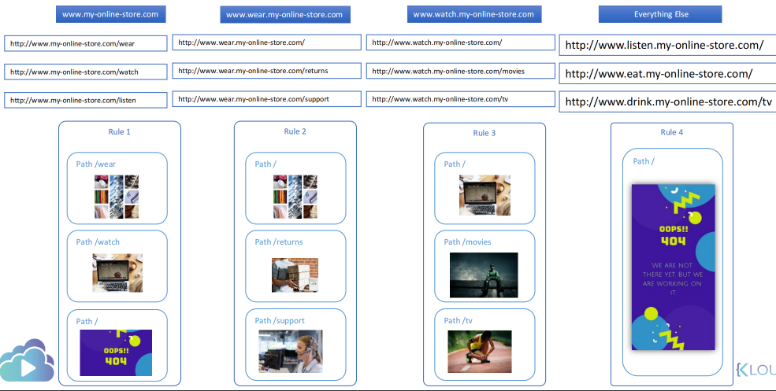

\

## Network Policies

<b>Traffic:</b> 

<div class="row">
<div class="col-md-6">
* Ingress: network traffic whose source lies in an external network, and sends to the destined node in the private network

* Egress: network traffic that begins inside a private network and proceeds through it's routers to a destination outside of the network

* Need rules for each of the flows to each port! 

* The response does NOT need rules

* By default, all pods have an "All Allow" rule so they can interact with each other.
</div>
<div class="col-md-6">
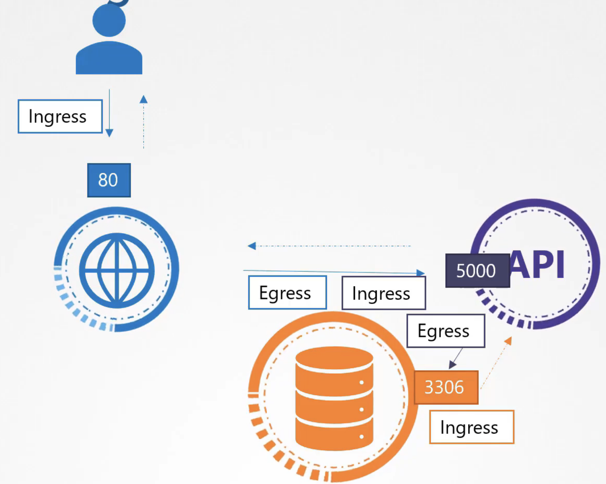
</div>
</div>

\

<b>Network Policies:</b> The kubernetes way to restrict communication between pods (ex: in the above, we would set a networkPolicy on the Database Pod such that only ingress traffic from the API Pod on port 3306 is allowed)

\

<div class="row">
<div class="col-md-6">
```
apiVersion: networking.k8s.io/v1
kind: NetworkPolicy
metadata:
  name: db-policy
  namespace: prod
spec:
  podSelector:
    matchLabels:
      role: db
    policyTypes:
    - Ingress
    - Egress
    ingress:
    - from:
      - podSelector:
          matchLabels:
            name: api-pod
        namespaceSelector:
          matchLabels:
            name: prod
       - ipBlock:
            cidr: 192.168.5.10/32
      ports:
      - protocol: TCP
        port: 3306
    egress:
    - to:
      - ipBlock:
          cidr: 192.168.5.10/32
      ports:
      - protocol: TCP
      - port: 80
```

</div>
<div class="col-md-6">

Tips to create network policies:

* Focus only on the link that you are wanting to enforce (in the above, that would be port 3306 between API and DB)

* Begin by specifying the pod which you want to restrict via `podSelector:`

* Block ALL traffic (Ingress and Egress) via `policyTypes:` and then peel away the traffic that should flow from the perspective of the specified pod

* Finally, include the pod/port info that can take Ingress/Egress traffic with respect to the target pod

* If you want the policy to only apply a certain namespace, use the `namespaceSelector:` argument

* If you want to allow a range of IP addresses to hit the pod, use `ipBlock:`

* The dashes represent OR, while a continuous list represents AND (ex: incoming traffic from pods must have name api-pod AND be in namespace prod OR the traffic must come from cidr 192.68.5.10/32)

* Notice the parity between the ingress/egress arguments. In this example, traffic can also flow TO the cidr because of the Egress policy.

* To specify multiple policies in one file, just continue to apply `to:` / `from:` conditions below `ingress:` / `egress:`
</div>
</div>

\
\

# State Persistence

## Volumes

* To persist data across multiple ephemeral pods, volumes are attached to containers and data processed is stored in them

* When volume created, can configure in various ways via `volume:` (ex: directory on host node)

* Use `volumeMounts:` to mount the volume onto the container

* When pod gets deleted, the data still lives on the host

* In the case of multiple nodes, want to use a scalable network storage solution (ex: AWS EBS) since the volume path could have different contents for each node (since they're different servers).

\

<div class="row">
<div class="col-md-6">
<br>
```
apiVersion: v1
kind: Pod
metadata: 
  name: random-number-generator
spec:
  containers:
  - image: alping
    name: alpine
    command: ["bin/bash", "-c"]
    args: ["shuf -i 0-100 -n 1 >> /opt/number.out;"]
    volumeMounts:
      - mountPath: /opt
        name: data-volume
  volumes:
  - name: data-volume
    hostPath:
      path: /data
      type: Directory
    -OR-
    awsElasticBlockStore:
      volumeID: <volume-id>
      fsType: ext4
```

</div>
<div class="col-md-6">

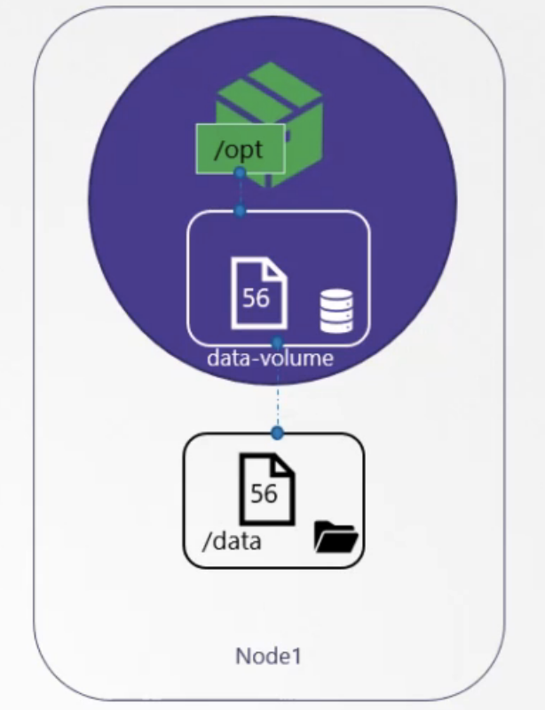
</div>
</div>

\

## Persistent Volumes

* Instead of defining a volume within every single pod and having to manually change each time, should go the direction of managing storage more centrally

* Strategy: Create a large pool of storage, with users "carving" out pieces as needed

* `accessModes:` come in three flavors: ReadOnlyMany, ReadWriteOnce, ReadWriteMany 

* `capacity:` How much storage would you like to allocate?

\

<div class="row">
<div class="col-md-6">
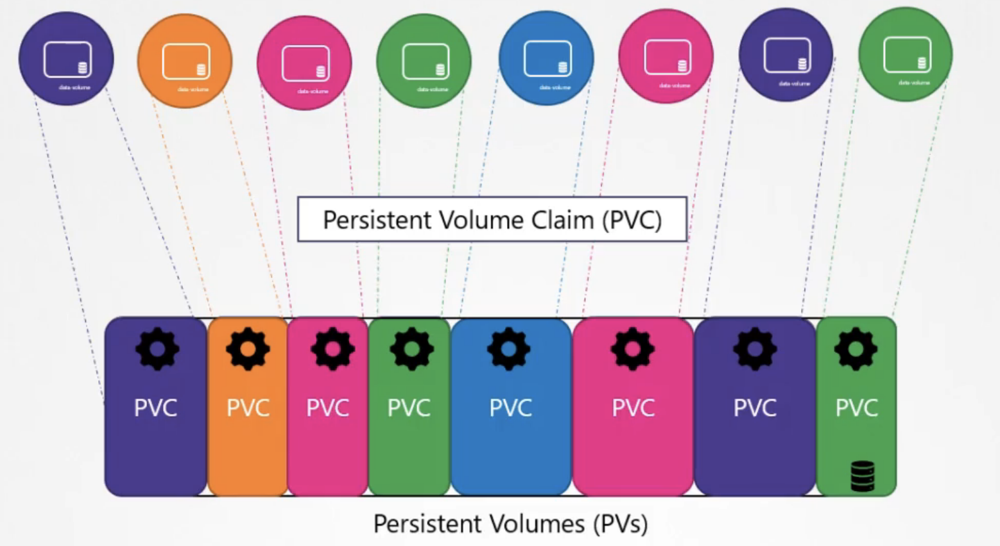
</div>
<div class="col-md-6">
```
apiVersion: v1
kind: PersistentVolume
metadata:
  name: pv-vol1
spec:
  accessModes:
    - ReadWriteOnce
  capacity:
    storage: 1Gi
  awsElasticBlockStore:
    volumeID: <volume-id>
    fsType: ext4
  persistentVolumeReclaimPolicy: Reclaim
```
</div>
</div>

\

<div class="row">
<div class="col-md-6">
```
apiVersion: v1
kind: PersistentVolumeClaim
metadata:
  name: myClaim
spec:
  accessModes:
    - ReadWriteOnce
  resources:
    requests:
      storage:
        500Mi
---
apiVersion: v1
kind: Pod
metadata:
  name: mypod
spec:
  containers:
    ...
  volumes:
  - name: mypd
    persistentVolumeClaim:
      claimName: myClaim
```
</div>
<div class="col-md-6">
<b>Persistent Volume Claims:</b> A separate object created by the user to use the persistent volume created by the administrator. Once created, k8 binds the PV to claims based on the request and properties set on the volume

* There is a one-to-one relationship between PVs and PVCs, so if a PVC does not utilize all the storage, there's the remainder can't be allocated anywhere else

* PVCs that can't find a PV will remain in a pending state until a PV with the proper configuration is created

* When a PVC is deleted, the PV is set to retain by default via `persistentVolumeReclaimPolicy: Retain` (Retain, Delete, Recycle-data gets scrubbed)
</div>
</div>

\

## Storage Classes

* Storage classes automatically provision persistent volumes when an application needs them
 
* Can define a provisioner (ex: Google Storage) that can automatically provision storage when a PVC is made (Dynamic Provisioning)

* In this way, manually creating a PV is no longer necessary! Rather than automatically identifying an already existing PV, one is spun up by the provisioner and linked via `storageClassName:` in the PVC

* SC (name) <--> (storageClassName) PVC (name) <--> (claimName) Pod 

* Each volume plugin has its own set of parameters for the SC... make sure you refer to appropriate documentation when tweaking them

\

<div class="row">
<div class="col-md-6">
```
apiVersion: v1
kind: PersistentVolumeClaim
metadata:
  name: myclaim
spec:
  accessModes:
    - ReadWriteOnce
  storageClassName: google-storage
  resources:
    requests:
      storage: 500Mi
---

apiVersion: storage.k8s.io/v1
kind: StorageClass
metadata:
  name: google-storage
provisioner: kubernetes.io/gce-pd
parameters:
  type: pd-standard
  replication-type: none
```
</div>
<div class="col-md-6">
```
apiVersion: v1
kind: Pod
metadata:
  name: random-number-generator
spec:
  containers:
  - image: alpine
    name: alpine
    command: ["/bin/sh", "-c"]
    args: ["shuf -i 0-100 -n 1 >> /opt/number.out ;"]
    volumeMounts:
    - mountPath: /opt
      name: data-volume
  volumes:
  - names: data-volume
    persistentVolumeClaim:
      claimName: myclaim
```
</div>
</div>

\

## Stateful Sets

* Do everything deployments can do, BUT pods are deployed in a sequential order! 

* Assigns unique original index for each pod in the order in which they were deployed

* Assigns meaningful names to each pod (as opposed to a random hash), maintaining a "sticky" identity

* If a deployment is scaled up, the most recent pod created will be cloned

<b>Note:</b> This is especially useful when setting up a replicated read database where the master is updated first, the first worker is replicated from this, then all other workers are replicated from the first worker. They are able to identify which IP is master to set up continuous replication moving forward. <b>This would be impossible with the random names of deployments!</b>

* Created in exactly the same way as a deployment, but with `kind: StatefulSet` and `serviceName: <headless-service-name>` as an argument under `spec:`

\

### Headless Services

* A service that does not load balance requests, but gives a DNS entry to reach each pod (ex: in above note, we'd only want to write to the master pod!)

* Web application can then use this DNS to directly point to the pod, where they are numbered by index (i.e. master = 0)

* To create a headless service, need to specify `clusterIP: None` in the service file and the `subdomain:` and `hostname:` in the pod definition. This will give all the pods the same DNS though!

  * Instead, we can omit the `subdomain:` and `hostname:`, add in a `serviceName:` argument under `spec:`, and turn the Deployment into a StatefulSet (see below). This object will automatically assign pod names in a meaningful way (as explained above!)

* DNS: `<pod-name>-<pod-idx>.<headless-service-name>.default.svc.cluster.local`

\

\

<div class="row">
<div class="col-md-6">
```
apiVersion: v1
kind: Service
metadata:
  name: mysql-h
spec:
  ports:
    - port: 3306
  selector:
    app: mysql
  clusterIP: None
```
\
\
\
\
\
\
\

### Storage in Stateful Sets

* Useful if you want to consistent connections between stateful pods and volumes.

* Rather than have its own YAML, the PVC is defined as a template within `volumeClaimTemplates:`

* Creation goes pod -> PVC -> SC for each replica

* Because volumeClaimTemplates is an array, you can specify multiple volume claim templates (i.e. pods with multiple containers and thus multiple volume mounts can be associated with their own vCTs)

</div>
<div class="col-md-6">
```
apiVersion: v1
kind: StatefulSet
metadata:
  name: mysql-deployment
  labels:
    app: mysql
spec:
  serviceName: mysql-h
  replicas: 3
  matchLabels:
    app: mysql
  template:
    metadata:
      name: myapp-pod
      labels:
        app: mysql
    spec:
      containers:
      - image: mysql
        name: mysql
        volumeMounts:
        - mountPath: /var/lib/mysql
          name: data-volume
  volumeClaimTemplates:
  - metadata:
      name: data-volume
    spec:
      accessModes:
        - ReadWriteOnce
      storageClassName: google-storage
      resources:
        requests:
          storage: 500Mi
```
</div>
</div>

\
\

# Docker

* Useful for holding the same exact virtual environment and ensuring that applications run the same exact way on all machines (virtual or physical)

* All Dockerfiles must start with a `FROM` statement, where we base our image off another image OR OS

* Builds image in layers, where each instruction creates a new layer (below ex has 5 layers)

* If a particular step fails, a rebuild will use already successfully layers up to that point to improve speed of build

* Can containerize all the things! 

<div class="row">
<div class="col-md-6">
<b>Basic Flask Image:</b>

<ol>
<li> OS - Ubuntu
<li> Update apt repo
<li> Install dependencies using apt
<li> Install Python dependencies using pip
<li> Copy source code to /opt folder
<li> Run the web server using "flask" command
<li> Build the image from the Dockerfile
<li> Push to registry
</ol>
</div>
<div class="col-md-6">
```
FROM Ubuntu

RUN apt-get update
RUN apt-get install python

RUN pip install flask
RUN pip install flask-mysql

COPY . /opt/source-code

ENTRYPOINT FLASK_APP=/opt/source-code/app.py flask run
```
```
docker build Dockerfile -t okeefe/my-custom-app
docker push okeefe/my-custom-app
```
</div></div>

\

## Common Commands

View available images and their properties: `docker images`

Start a container: `docker start <container>`

(-i: Attach to STDOUT)

Run a command against the container: `docker exec <container> <command>`

Drop into a shell prompt: `docker exec -it <container> <shell>`

Copy a file to the container: `docker cp <source> <container>:<destination>`

Copy from a container to localhost: `<container>:<source> <destination>`

Stop a container: `docker stop <container>`

Restart a container: `docker restart <container>`

Remove a container: `docker rm <container>`

Remove all stopped containers: `docker container prune`

Rename a container: `docker rename <container> <new-name>`

View a container's metrics: `stats <container>`

View container information: `docker inspect <container>`

Create container image: `docker commit <container> <name>`

Map container port to host server: `docker run -p <host_port>:<container_port> container`


\
\

# Authentication, Authorization, and Admission Control

## Authentication

* How do we secure access to the Kubernetes cluster via authentication mechanisms?

* Administrative purposes, NOT necessarily the end users within the application itself

* K8 relies on external sources for users, so you can't list out these users (except possibly via serviceaccounts)

* kube-apiserver can be authenticated via:

  * <b>static password file:</b> list of users/passwords in csv files. Pass (password, username, user id) and pass it via `--basic-auth-file=user-details` in the kube-apiserver.service file. If using the Kubeadm tool to set up cluster, need to put this under `containers: -command:` within pod file. Finally, to authenticate the user in the csv, run a curl command with a tag `-u "user1:password123"`
  
  * <b>static token file:</b> can add in an additional "group" column that connects to a user-token-details file. This can then be referenced within curl commands via `--header "Authorization: Bearer <token-here>"`
  
  
## KubeConfig

<div class="row">
<div class="col-md-6">

* When a certificate has been set up within a K8 cluster, that user will have to provide their credentials (server, client-key, client-certificate, certificate-authority) as options every time they run a command

* Can leverage KubeConfig in order to store these credentials in a file and then simply reference them with a single argument

* OR EVEN BETTER, put the config file in the appropriate path and we won't even need to reference kubeconfig (what is set up by default)

</div>
<div class="col-md-6">
```
# Config File ($HOME/.kube/config)
--server my-kube-playground:6443
--client-key admin.key
--client-certificate admin.crt
--certificate-authority ca.crt
```

```
kubectl get pods
  --kubeconfig config
```
</div>
</div>

\

<b>Contexts:</b>

<div class="row">
<div class="col-md-6">
```
apiVersion: v1
kind: Config
current-context: dev-user@google
clusters:
- name: my-kube-playground
  cluster:
    certificate-authority: ca.crt
    server: https://my-kube-playground:6443
- name: development
  ...
- name: production
  ...
- name: google
  ...  
contexts:
- name: my-kube-admin@my-kube-playground
  context:
    cluster: my-kube-playground
    user: my-kube-admin
    namespace: finance
- name: dev-user@google
  ...
- name: prod-user@production
  ...

users:
- name: my-kube-admin
  user:
    client-certificate: admin.crt
    client-key: admin.key
- name: admin
  ...
- name: dev-user
  ...
- name: prod-user
  ...
```
</div>
<div class="col-md-6">
* Contexts form the connection between the cluster and the user in question

* Which context should kubectl start with? `current-context:`

* View current file being used: `kubectl config view --kubeconfig=<custom-config-here>`

* To use config operations on a config file that's not the default, specify via the `--kubeconfig` flag

* Update context (edits the config file): `kubectl config use-context <context-here>`

* Config file can also take on namespaces for a given context

* Certificates for users: `/etc/kubernetes/pki/users`

\


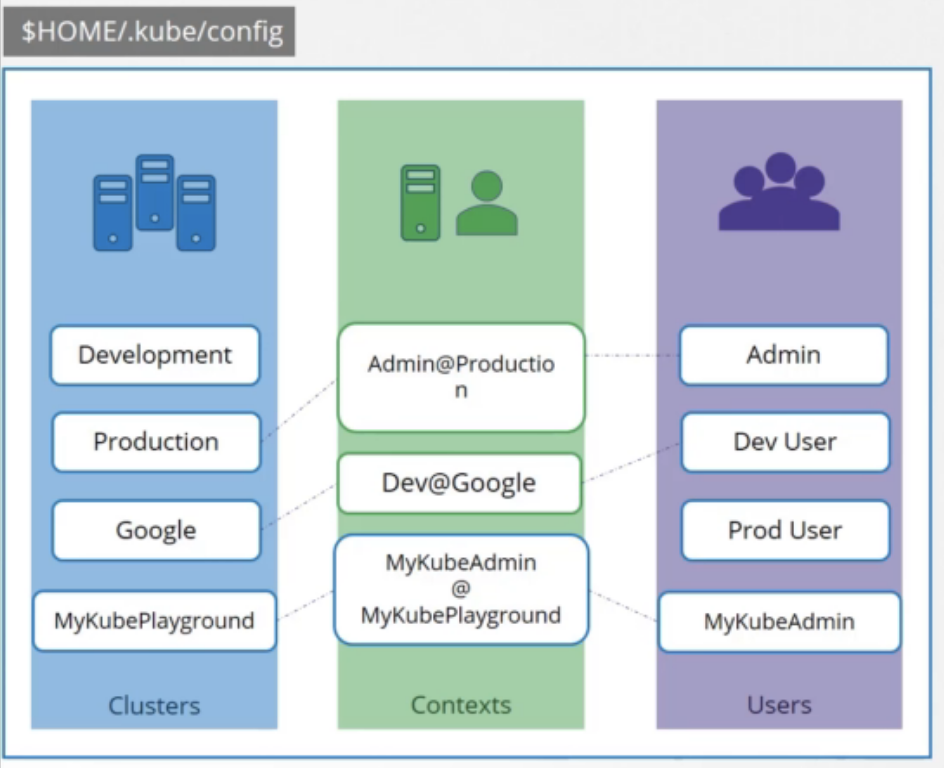
</div>
</div>

\

## Authorization

* Once a user gains access to the cluster, what can they do?

* Three types: 

<ol>
<li> Node Authorization:  setting up namespaces to authorize the kubelet to post commands to the kube API
<li> Attribute-Based Authorization (ABAC): user/group of users is associated with rules defined in a json format; must be updated manually
<li> Role-Based Authorization (RBAC): define a role with a set of permissions and then associate all relevant users with that role; roles can be updated and it propogates to the users
<li> Webhook: a way to manage the authorization outside the k8 environment via an open policy agent
</ol>

* To identify the type of authorization or edit for a cluster, look for `authorization-mode` in the path: `/etc/kubernetes/manifests/kube-apiserver.yaml`

\

### Role-Based Access Controls


<div class="row">
<div class="col-md-6">

* Must first define the role via `kind: Role`, then specify the associated users via `kind: RoleBinding`

Role: 
```
kubectl create role <role-name> --verb=<comma-separated> --resource=<resource>
```

Rolebinding: 
```
kubectl create rolebinding <rolebinding-name> --role=<role-name> --user=<user-name>
```

* These are all created within the boundaries of namespaces (no assigned namespace means default)

* As a user, can check for your own access via: `kubectl auth can-i <verb> <object>`

* As admin, can add `--as <user-type> --namespace <namespace-here>` flag to test from their perspective for a specific namespace

* `resourceNames:` allows the specific subset of objects that are allowed the permissions.

</div>
<div class="col-md-6">
```
apiVersion: rbac.authorization.k8s.io/v1
kind: Role
metadata:
  name: developer
rules: 
- apiGroups: [""]
  resources: ["pods"]
  verbs: ["list", "get", "create", "update", "delete"]
  resourceNames: ["blue", "orange"]
- apiGroups: [""]
  resources: ["ConfigMap"]
  verbs: ["create"]

---

apiVersion: rbac.authorization.k8s.io/v1
kind: RoleBinding
metadata:
  name: devuser-developer-binding
subjects:
- kind: User
  name: dev-user
  apiGroup: rbac.authorization.k8s.io
roleRef:
  kind: Role
  name: developer
  apiGroup: rbac.authorization.k8s.io
```

</div>
</div>

\

### Cluster Roles

* Resources are categorized either in terms of namespaces OR cluster scope

* Namespaces: pods, replicasets, jobs, deployments, services, secrets, roles, rolebindings, configmaps, PVC
```
kubectl api-resources --namespaced=true
```

* Cluster Scopes: nodes, PV, clusterroles, clusterrolebindings, certificatesingingrequests, namespaces
```
kubectl api-resources --namespaced=false
```

* Clusterroles/clusterrolebindings are exactly the same concept as role/rolebinding and follow the same yaml/imperative syntax

* While you can't assign namespaces to cluster-scoped objects, you CAN assign clusterroles to namespaced objects. In doing this, you are defining the permissions for the user for the object type across all namespaces


\

## Admission Controllers

* While RBAC does allow the API-level restrictions, we can't really enforce how a cluster is used (ex: restricting images from a certain registry, permitting runs as root, only allowing pods to run certain capabilities)

* Admission Controller Examples: AlwaysPullImages, DefaultStorageClass, EventRateLimit, NamespaceExists...

* NamespaceExists: if we try as an admin to create a pod in a non-existent namespace "blue", admin status is authenticated, the capability of creating a pod is authorized, BUT the admission controller catches that "blue" does not exist and throws an error before the pod is created. If we enable the NamespaceAutoProvision controller, then this would actually create the nonexistent "blue" namespace.

* View enabled admission controllers: `kube-apiserver -h | grep enable-admission-plugins` OR
`ps -ef | grep kube-apiserver | grep admission-plugins`

* From kubeADM: `kubectl exec kube-apiserver-controlplane -n kube-sytem -- kube-apiserver -h | grep enable-admission-plugins`

* To update admission controllers, edit `/etc/kubernetes/manifests/kube-apiserver.yaml` such that the command options include `- --enable-admission-plugins=<comma-separated-controller-names>`

\

### Validating/Mutating Admission Controllers

* A mutating ac can change (mutate) a request

* A validating ac can validate a request before it is sent

* Some AC's can be both

* In some cases, order of ACs matter! The (mutating) NamespaceAutoProvision controller must be run before the (validating) Namespace exists controller else it will fail every time.

<div class="row">
<div class="col-md-6">
<b>Create your own AC:</b> MutatingAdmissionWebhook, ValidatingAdmissionWebhook

* Goes through the list until it hits the above Webhook titles

* Makes a call to the admission webhook server by passing in an admission review object in json (user, verbs used, object details, etc...)

* Webhook server responds with a "true" or false" json object

* Need to (1) deploy a admission webhook server, then (2) create a webhook configuration object

* Usually the server is custom created code with functions "mutate()/validate()". These contain the logic to verify a request and returns a json object

</div>
<div class="col-md-6">
<center>
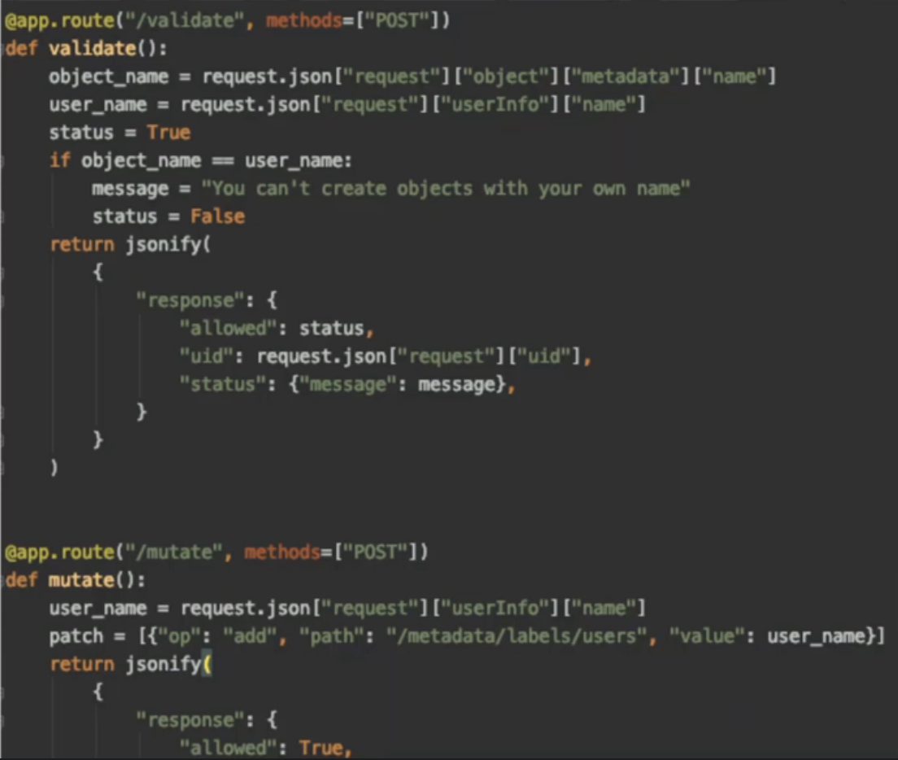
</center>
</div>
</div>

\

<div class="row">
<div class="col-md-6">
```
apiVersion: admissionregistration.k8s.io/v1
kind: ValidatingWebhookConfiguration
metadata:
  name: "pod-policy.example.com"
webhooks:
- name: "pod-policy.example.com"
  clientConfig:
    url: "https://external-server.com"
    OR
    service:
      namespace: "webhook-namespace"
      name: "webhook-service"
    caBundle: "Cuasndj4sX...asdf59l"
  rules:
    - apiGroups: [""]
      apiVersions: ["v1"]
      operations: ["CREATE"]
      resources: ["pods"]
      scope: "Namespaced"
```
</div>
<div class="col-md-6">

* We can then create a webhook-deployment pod that is exposed to the cluster via a service.

* Put the service configuration (namespace/name) under `clientConfig:`, with `caBundle:` being the requirement that the server has to be configured with a certificate pair. 

* `rules:` tell us when the webhook configuration should be called

</div>
</div>

\
\

# API Information

* API groups: /metrics, /healthz, /version, /api, /apis, /logs

* The objects that we create are held within /api and /apis (shown below)

<div class = "row">
<div class = "col-md-7">
<center>
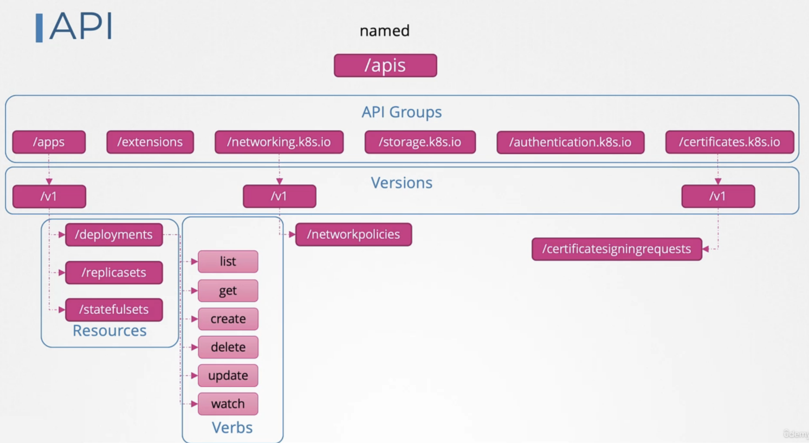
</center>
</div>
<div class = "col-md-5">
<center>
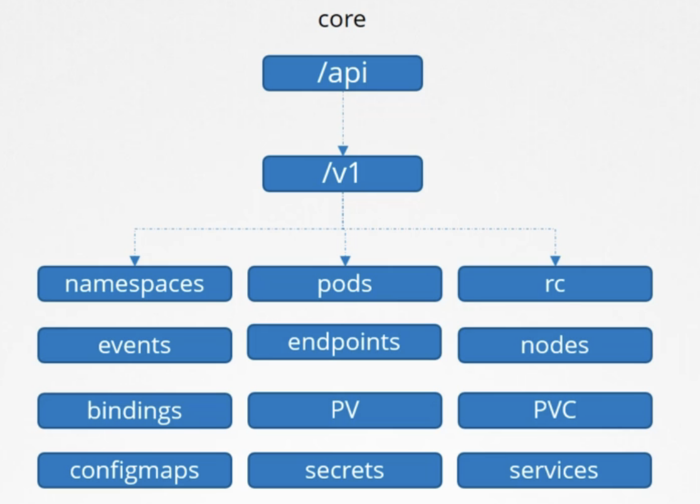
</center>
</div>
</div>

\

* Can find the list of api resources via command: `kubectl api-resources`

* Each API has different versions; v1 is GA/stable, whereas there are also v1alpha1 (first developed and merged, can only be enabled via flags) and v1beta1 (major bugs fixed, commitment to be moved to GA in the future)

* API groups can support multiple versions in the same time; "preferred" version is that set by default, "storage" version in which an object is stored in `etcd`

* To enable versions of api groups (for ex: v2alpha1), you need to edit the kube-apiserver parameter with `--runtime-config=batch/v2alpha1` and restart the server

\

<b> API Depreciation Policy Rules:</b>
<ol>
<li> API elements may only be removed by incrementing the version of the API group
<li> API objects must be able to round-trip between API versions in a given release without information loss, with the exception of whole REST resources that do not exist in some versions
<li> An API version in a given track may not be deprecated until a new API version at least as stable is released
<li> Other than most recent API versions in each track, older API versions must be supported after their announced deprecation for a duration of no less than GA:(12mo/3re) Beta:(9mo/3re) Alpha:(0re)
<li> The preferred API version and the stored API version for a given group may not advance until after a release has been made that supports both the new version and the previous version
</ol>

* Converting yaml (may need to install plugin): `kubectl convert -f <old-file> --output-version <new-api>`

\
\

# Custom Resources

* We can use Custom Resource Definitions to create resources and place them into `etcd`. Below is the example for a "flight ticket" object

<div class = "row">
<div class = "col-md-6">
```
apiVersion: flights.com/v1
kind: FlightTicket
metadatta:
  name: my-flight-ticket
spec:
  from: Mumbai
  to: London
  number: 2
```

* Need to first create the definition: `kubectl create -f flightticket-custom-def.yaml`

* Then can create the object: `kubectl create -f flightticket.yaml`
</div>
<div class = "col-md-6">
```
apiVersion: apiextensions.k8s.io/v1
kind: CustomResourceDefinition
metadata:
  name: flighttickets.flights.com
spec:
  scope: Namespaced
  group: flights.com
  names:
    kind: FlightTicket
    singular: flightticket
    plural: flighttickets
    shortNames:
      - ft
  versions:
    - name: v1
      served: true
      storage: true
  schema:
    openAPIV3Schema:
      type: object
    properties:
      from:
        type: string
      to:
        type: string
      number:
        type: integer
        minimum: 1
        maximum: 10
```
</div>
</div>

\

* While we can now create this resource and store it in `etcd`, how do we actually do something with it?

\

<b>Custom Controllers: </b>

* controller - any process or code that runs continuously and listens to k8 for specific objects being changed

* would write code (ex: in Go) that listens to the API and builds logic about how to create everything (you probably need to figure out Go since there's a lot of support and repos for skeletons of Custom Controllers)

* Can package this custom controller within a docker image and deploy it on a pod

\

<b>Operators: </b>

* Can use the operator framework to package a CRD and a Custom Controller into one nice command

* Ex: etcd operator has CRDs/Controllers for creating clustors, backing up etcd, and restoring etcd

* Can find more information and applications to deploy in this way via <a href="https://www.operatorhub.io" target="_blank">OperatorHub.io</a>

\
\

# Helm

* A "package manager" for Kubernetes that allows us to view our applications as applications rather than a set of objects

* All we have to do is tell what package we want, and it'll create all the needed objects to make the package work

* Can specify customize desired app settings by declaring them at the time of install

* There's a single location `values.yaml` where we can change all the applications

* Can upgrade, rollback, and uninstall applications in a single line: `helm <verb> <application>`


<b>Installation:</b>

* Must have a functional k8 cluster and kubectl that works with it

* <a href="https://helm.sh/docs/intro/install/#from-apt-debianubuntu" target="_blank">Click here</a> to find installation documentation for Ubuntu

<b>Concepts:</b>

* To turn yaml files into a Helm chart, should throw all of them into a `templates` directory and parameterize via `{{.Values.<variable-name>}}`

* These values are stored in `values.yaml`. Can then just change the parameters in this single file

* <a href="https://artifacthub.io" target="_blank">Artifacthub.io</a> is a community-driven public repository containing charts for desired applications

* can also search via command line: `helm search hub <application-name>`

* There are other repos! Add to helm via: `helm repo add bitnami https://charts.bitnami.com/bitnami` and then look via `helm search repo <application-name`

* Install the chart: `helm install <release-name> <chart-name>` (release is essentially a unique label so that you can install multiple instances of the same chart)

* Download but NOT install chart: `helm pull --untar bitnami/wordpress`

* The above is useful to update the `values.yaml` before using the path of the files to install customized chart: `helm install release-4 ./wordpress`

* List installed charts from repos: `helm repo list`

* Uninstall helm chart: `helm uninstall <release-name>`